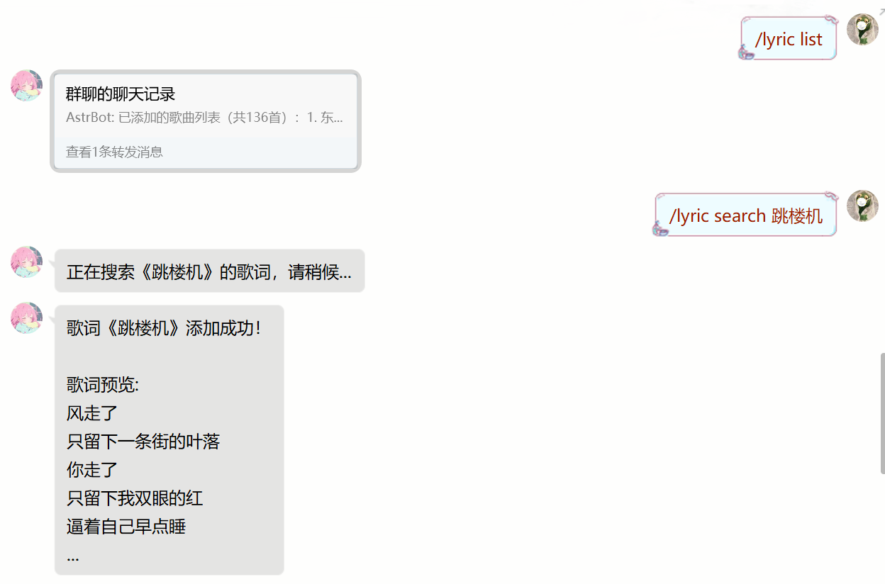

# LyricNext

AstrBot 歌词接龙插件，当你发送一句歌词，机器人会回复下一句。

## 功能特点

- 支持本地歌词库，用户可自定义添加歌词
- 支持网易云音乐、QQ音乐、酷狗音乐三大平台歌词检索
- 优化的歌词匹配算法，提高识别准确率
- 歌词文件自动过滤，保持纯净的歌词内容
- 智能语言检测，英文歌词和中文歌词分别处理
- 支持歌词管理面板（单独项目）

## 版本更新

### v1.1.0 (2025-06-16)
- 🐛 **修复配置文件读取bug**: 迁移到 AstrBot 标准配置系统，通过管理界面配置
- 🐛 **修复英文歌词处理bug**: 添加智能语言检测，英文歌词不再被错误拆分
- ✨ **新增功能**: 支持歌词管理面板（单独仓库）
- 📚 **改进文档**: 更新配置说明和使用指南

### v1.0.0
- 🎉 初始版本发布
- ✨ 基础歌词接龙功能
- ✨ 多平台歌词搜索
- ✨ 批量下载工具

## 使用方法

### 基本功能
1. **歌词接龙**: 直接发送歌词，机器人会匹配并回复下一句
2. **搜索歌词**: `/lyric search <歌名> [歌手名] [音乐源]` - 搜索并添加歌词到歌词库
3. **查看列表**: `/lyric list` - 列出所有已添加的歌曲
4. **查看歌词**: `/lyric view <歌曲名>` - 查看指定歌曲的完整歌词内容
5. **重新加载**: `/lyric reload` - 重新加载歌词库
6. **查看帮助**: `/lyric help` - 查看详细使用帮助

### 搜索歌词参数

`/lyric search` 命令支持以下几种参数输入方式：

- `/lyric search 晴天` - 只指定歌名
- `/lyric search 晴天 周杰伦` - 指定歌名和歌手名  
- `/lyric search 晴天 周杰伦 QQ音乐` - 指定歌名、歌手名和音乐源

### 音乐源参数

在使用 `/lyric search` 命令时，可以指定音乐源参数以精确搜索特定平台的歌词，支持的音乐源包括：

- `网易云`、`netease` - 从网易云音乐搜索歌词
- `QQ音乐`、`qq` - 从QQ音乐搜索歌词
- `酷狗`、`kugou` - 从酷狗音乐搜索歌词

例如：`/lyric search 晴天 周杰伦 QQ音乐` 将从QQ音乐搜索周杰伦的《晴天》。

## 批量下载工具

### 自动下载歌手全部歌曲
如需批量下载某个歌手的所有歌曲，可以运行：
```bash
python tools/fetch_lyrics.py
```
该工具支持：
- 选择不同音乐平台（网易云、QQ音乐、酷狗音乐）
- 批量下载指定歌手的所有歌曲歌词
- 自动过滤和保存纯净歌词文件

### 单独搜索歌曲
也可以单独运行搜索工具：
```bash
python tools/search_lyrics.py
```
用于单独搜索和下载特定歌曲的歌词。

## 数据存储
- 歌词文件存储在 `Astrbot/data/plugins/astrbot_plugin_lyricnext/data/lyrics` 目录下
- 每首歌一个文本文件，经过智能过滤，只保留纯净的歌词内容
- 自动去除作词、作曲、编曲等信息行
- 智能语言检测：英文歌词保持完整，中文歌词支持空格拆分
- 为方便提前下载和管理歌词，歌词文件未存储在 AstrBot/data 根目录下
- **重要**: 本仓库的歌词库仅作为示例，不再维护更新，建议使用独立的歌词数据仓库

## 配置选项

可通过 AstrBot 配置界面调整以下参数：
- `preprocess_lyrics`: 是否预处理歌词以提高匹配准确率
- `match_threshold`: 歌词匹配阈值,默认0.8（0.1-1.0，越高越精确）

## 相关项目

### 歌词管理面板
为了更好的歌词管理体验，提供了独立的Web管理面板：

> **📝 管理面板仓库**: https://github.com/EEEpai/astrbot_plugin_lyricnext_admin
> 
> 功能特点：
> - 可视化歌词库管理
> - 歌词搜索和预览
> - 批量操作支持
> - 歌词质量检测

### 歌词数据仓库
提供预制的歌词数据库，方便快速部署：

> **🎵 歌词数据仓库**: https://github.com/EEEpai/astrbot_plugin_lyricnext_lyrics
> 
> 说明：
> - 包含精选歌词数据
> - 定期更新歌词库
> - 本插件仓库的歌词库不再更新

## 重要说明

- **歌词库更新**: 本仓库的 `data/lyrics` 目录不再维护更新，请关注独立的歌词数据仓库
- **管理面板**: 推荐使用独立的管理面板项目进行歌词管理
- **数据备份**: 迁移插件时请注意备份您的歌词数据

---

---
